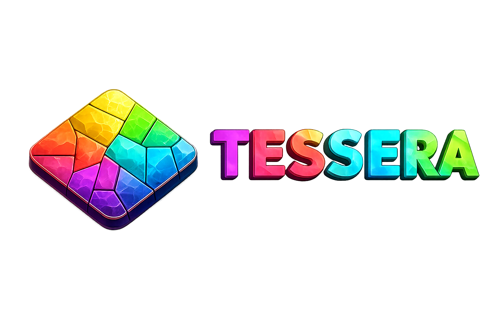

<p align="center">
    
</p>

# Tessera

**A Minecraft server with parallel region ticking, dynamic worlds, and region-safe plugin APIs.**

Tessera develops its own server features, gameplay fixes, and tools for running
multiple worlds and independent game areas. Its integrated base, **Sinopia**, is
maintained alongside Tessera in this repository.

**Current version:** Minecraft **26.3** · Tessera **005-alpha** · Java **25**

Tessera is in active alpha development. The
[release changelog](docs/CHANGELOG-26.3-005-RELEASE.md) documents the current
baseline and validation status; test your worlds and plugins before deployment.

## What Tessera provides

| Feature | What it does |
| --- | --- |
| Parallel region ticking | Processes independent loaded areas on separate tick threads. |
| Runtime worlds | Creates, loads, and unloads worlds asynchronously through the Tessera API. |
| World cloning and snapshots | Clones read-only world templates and takes coordinated snapshots of live worlds. |
| Region-safe scoreboards | Supports per-player scoreboards, teams, objectives, and scores with updates delivered on the owning player thread. |
| Console and RCON support | Routes supported vanilla block and entity queries to the region that owns their data. |
| Tick control | Supports querying, changing, freezing, stepping, and sprinting the server tick loop. Players must be OP to use `/tick`. |
| Plugin extensions | Provides regional TPS measurements, capability detection, and additional game rules such as control over Eyes of Ender and End portal use. |

Gameplay and compatibility fixes are maintained with regression tests and
documented in [the project documentation](docs/).

## How regions work

Tessera groups nearby loaded chunks into regions. Each region runs its own tick
loop, allowing independent areas to be processed in parallel. Regions can merge
or split as the set of loaded chunks changes.

This allows activity in separate arenas, islands, or distant parts of a world
to use multiple CPU cores. Activity inside one region still shares that region's
tick budget. Actual performance depends on the world, plugins, and workload.

Plugin code must respect the region that owns a block, chunk, or entity. There
is no single Bukkit main thread that can safely access every world at once.

## Build Tessera

Requirements: **JDK 25** and **Git**. Use the included Gradle wrapper, which pins
the Gradle version required by the build tooling.

Run from the repository root:

**Windows / PowerShell**

```powershell
.\gradlew.bat buildTessera
```

**Linux / macOS**

```bash
./gradlew buildTessera
```

The build prepares Sinopia, applies the patch layers, runs the tests, and creates
the runnable server JAR under:

```text
build/libs/tessera-server-*.jar
```

Copy the resulting JAR into your server directory and run it with Java 25.
Sinopia is included in this repository; build dependencies are resolved by Gradle.

For source editing, patch export, and upstream updates, see the
[Sinopia and Tessera workflow](docs/SINOPIA-WORKFLOW.md). Export changes to
generated sources into patches before running `buildTessera` again.

## Plugin compatibility

Plugins must support region-based execution. Bukkit or Paper compatibility
alone does not establish compatibility with Tessera.

The inherited plugin metadata flag is still required:

```yaml
api-version: '26.3'
folia-supported: true
```

This flag declares support; plugin code must also follow the threading rules:

- Use the **RegionScheduler** for location-bound world and block operations.
- Use the **EntityScheduler** for players and other entities, including after teleports.
- Use the **GlobalRegionScheduler** for global server work.
- Keep blocking file and database work off tick threads.
- Use `teleportAsync` for teleports and `RuntimeWorldManager` for runtime world operations.

Plugins using Tessera extensions can check `Bukkit.getTesseraCapabilities()`
for runtime-world and scoreboard support. Compile those plugins against the
matching Tessera API build; inherited package names and API coordinates remain
for compatibility.

See the [Tessera API reference](docs/tessera-api.md) for the API contracts and
examples. Some examples describe earlier releases; use the API version that
matches your server build.

## Documentation and tests

- [Build, patches, and Sinopia workflow](docs/SINOPIA-WORKFLOW.md)
- [Runtime worlds, cloning, and snapshots](docs/runtime-world-lifecycle.md)
- [Region-safe scoreboards](docs/region-safe-scoreboards.md)
- [Console and RCON command handling](docs/console-command-context.md)
- [Operator-only tick commands](docs/tick-operator-access.md)
- [Redstone region-merge test and results](smoke-tests/redstone-region-merge/RESULTS.md)
- [Minecraft 26.3 release changelog](docs/CHANGELOG-26.3-005-RELEASE.md)

Reproducible server tests live in [`smoke-tests/`](smoke-tests/). Each test
documents its setup and scope; individual test results apply to the scenarios
and builds they cover.

## Project structure

| Path | Purpose |
| --- | --- |
| `sinopia/` | The maintained Paper-derived server base. |
| `folia-api/paper-patches/` | Tessera's API patch layer. |
| `folia-server/paper-patches/` | Server implementation and test patches. |
| `folia-server/minecraft-patches/` | Minecraft gameplay and region-threading patches. |
| `docs/` | Feature documentation, changelogs, and validation reports. |
| `smoke-tests/` | Local server integration tests. |

The `folia-*` module names are retained from the project's history. The server
product built from this repository is Tessera. Generated source directories
are build workspaces; their Minecraft changes are maintained as patches.

## Origins and licensing

Tessera grew out of Folia and builds on the work of the Paper, Folia, Bukkit,
and Spigot projects. Their contributions, authorship, and license notices
remain part of the project.

[PATCHES-LICENSE](PATCHES-LICENSE) describes the license for the API and server
patches under `folia-api/` and `folia-server/`, except where noted otherwise.
Sinopia retains the upstream [license overview](sinopia/LICENSE.md),
[license texts](sinopia/licenses/), and per-file notices. Its provenance and
local changes are recorded in [sinopia/BASELINE.md](sinopia/BASELINE.md).
