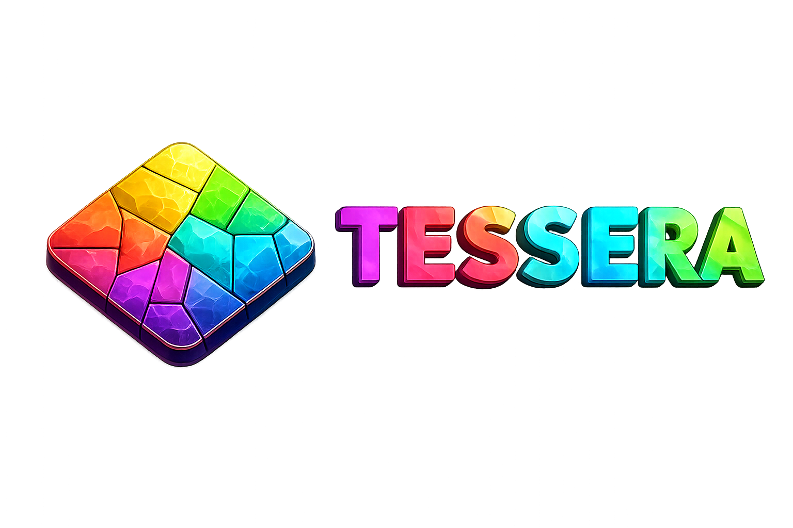

<p align="center">
    
</p>

# Tessera

A Minecraft server with parallel region ticking, runtime worlds, and region-aware
plugin APIs. Tessera is intended for SMP servers, independent arenas and
multi-world game modes whose plugins support Folia's threading model.

**Current branch:** `ver/26.3.x` · **Minecraft/API:** `26.3` ·
**Tessera:** `014-beta` · **Java:** `25`

Tessera uses the **beta** channel; this is not a blanket production guarantee.
The [current changelog](docs/builds/26.3/0.0.14.md) and
[Build 014 integration report](docs/BUILD-26.3-014.md) distinguish implemented
features from completed tests and outstanding integration checks. Older 26.2
and 26.3 RC entries in the [release history](docs/builds/) are historical,
not a promise that this branch builds or supports all those versions.

## Sinopia, Folia, and Tessera

**Sinopia** is the maintained, Paper-derived base included in this repository.
It is not a separate server installation, Git submodule, or independently
versioned Tessera release. Its original Paper import and subsequent local
changes are recorded in [the baseline](sinopia/BASELINE.md).

The build starts from Sinopia and applies Folia's region-threading layer and
Tessera's API, implementation and Minecraft patches. Paper/Bukkit package names
and the inherited `folia-*` module names remain for compatibility. The runnable
product is Tessera; Sinopia changes are documented in its release changelogs.

Sinopia permits local fixes and selective upstream integration without a separate
Paper checkout on every build. It does **not** remove dependencies on Minecraft,
Mache, Paperweight, Gradle, or external libraries. `paperRef` records the original
import; changing that hash alone does not update the local base. See the
[build and upstream workflow](docs/SINOPIA-WORKFLOW.md).

## Available features

| Feature | Current implementation and limits |
| --- | --- |
| Parallel region ticking | Independent loaded regions can tick concurrently; chunks in the same region share a tick budget. |
| Runtime worlds | Asynchronous create, load, clone and unload through `Bukkit.getRuntimeWorldManager()`; synchronous Bukkit world operations remain restricted. |
| World snapshots | Coordinated snapshots of live worlds, player stores and shared level-root data. Participating worlds pause during flush/copy; this is not an unrestricted filesystem backup or a power-loss-atomic transaction. |
| Native player restore | Contract 1 through `Bukkit.getPlayerRestoreService()`: connected-player state replacement, prepared target worlds and rollback. Requires explicit plugin integration, not an automatic SMP rollback feature. |
| Scoreboards | Region-aware per-player scoreboards, teams, objectives and scores, with delivery on the owning player thread. |
| Console/RCON commands | Region routing for supported Vanilla block queries and entity commands; unsupported cross-region or unloaded targets are rejected rather than bypassing thread checks. |
| Tick control | Rate, freeze, step and sprint support. Player use of `/tick` requires actual OP status, not only a granted permission. |
| Regional TPS display | English, clickable `/tps` overview, `/tps player <name>`, region details and `/tps all`, using existing server measurements and `bukkit.command.tps`. |
| Gameplay and API corrections | Region-safe runtime structure post-processing, portal/respawn handling, Ender pearl/stasis and locator-bar adaptations, plus documented Vanilla and plugin fixes. |

The native restore backend was tested with connected protocol clients, including
repeat load/save, rollback, dimensions and error recovery. The complete
**MCC/MVE/TAB/LuckPerms integration remains a separate acceptance test**; native
tests are not a claim that this plugin stack or every Vanilla interaction passed.
See [restore contracts and test boundaries](docs/mcc-player-restore-status.md).
Without a caller starting a restore, no restore transaction or restore login
barrier is automatically started; the supporting save/thread hooks still exist.

## How regions work

Nearby loaded chunks form regions that can merge or split as chunk ownership
changes. Each region has its own tick loop. Independent regions can run on
different worker threads; a large machine inside one region still consumes
that region's tick budget. Distance alone does not guarantee a split.

There is no single Bukkit main thread that can safely access all worlds.
The global-region thread handles global coordination, not arbitrary blocks or
entities. CPU capacity, shared I/O, global work and plugins can still affect
multiple regions: region separation is not a guarantee of lag isolation.
See [the region architecture](REGION_LOGIC.md) and
[TPS measurements and their limits](docs/TPS-REGION-OVERVIEW.md).

## Install and update

1. Obtain a Tessera JAR built from the intended source revision, or build it below.
   This branch produces `tessera-server-26.3.build.014-beta.jar` for Minecraft
   **26.3** clients, not RC2/RC3 clients. Use Java **25** to run it.
2. Use a dedicated server directory. Before migrating an existing server, stop it
   cleanly and make a separate backup of **all** worlds, player stores, level-root
   data, plugin data and configuration. First try the update on a copy.
3. Copy the runnable JAR into that directory. Start it from that directory, for example:

   ```text
   java -Xms2G -Xmx4G -jar tessera-server-26.3.build.014-beta.jar --nogui
   ```

   The heap values are examples, not sizing guarantees. Leave memory and CPU
   capacity for the operating system and server workers.
4. Read the generated `eula.txt`; set `eula=true` only if you accept its terms.
   Review the generated configuration and restart. Install only plugins verified
   for this Minecraft/API version **and** region-based execution.
5. Before opening the server to players, test joins, world changes, saves, shutdown
   and restart with the actual plugin set. For an update, replace the JAR while
   stopped and perform a full restart; do not rely on plugin reloads.

Read the target [release notes](docs/builds/) before each update. Minecraft data
upgrades and plugin migrations may make a downgrade unsafe: rollback means
restoring the complete pre-update backup, not just swapping an older JAR in.
Paper plugin compatibility alone does not make a Paper server an automatically
safe drop-in migration to Tessera.

## Build and develop

Requirements: **JDK 25**, **Git**, and network access to the build dependencies.
Use the included Gradle wrapper, currently **9.8.0**, with the configured
Paperweight **2.0.0-beta.24**. Do not upgrade one build layer independently.

Run from the **Tessera repository root**, not from `sinopia/`:

**Windows / PowerShell**

```powershell
.\gradlew.bat buildTessera
```

**Linux / macOS**

```bash
./gradlew buildTessera
```

This prepares Sinopia, reapplies all patch layers, runs the tests/checks and
creates the runnable JAR in `build/libs/`. The Build 014 source base,
SHA-256 and actual test results are in [its integration report](docs/BUILD-26.3-014.md).
For offline identity metadata affected by the old restore preview, follow the
[backup and field-level repair guide](docs/restore-player-metadata-repair.md).

Export edits to generated sources into the proper patches **before** rerunning
`buildTessera`. A normal `build` uses an already prepared source workspace; it
does not replace the complete patch preparation workflow. Follow
[Sinopia/Tessera patch development](docs/SINOPIA-WORKFLOW.md) for edits,
rebuilds, upstream integration and workspace safeguards.

Release notes now belong only in `docs/builds/<minecraftVersion>/<version>.md`.
Use the [maintenance guide and validator](docs/builds/README.md); Sinopia changes
belong to the same Tessera release. This does not change the separately managed
website landingpage or automatically import this README.

## Plugin compatibility

Plugins must declare Folia support **and actually obey its threading rules**.
Adding the metadata flag to an incompatible plugin does not fix it:

```yaml
api-version: '26.3'
folia-supported: true
```

- Use `RegionScheduler` for location-bound block/world work.
- Use an entity's `EntityScheduler` for players and entities, including after
  region or dimension changes.
- Use `GlobalRegionScheduler` only for genuinely global work; it grants no
  ownership of foreign chunks or entities.
- Keep blocking file/database work off tick threads and never synchronously
  wait for asynchronous world, teleport, snapshot or restore futures there.
- Use `teleportAsync` and the runtime-world API where appropriate.

Compile against the matching Tessera API for its extensions. Detect runtime-world
and scoreboard capabilities with `Bukkit.getTesseraCapabilities()`; check
`PlayerRestoreService.contractVersion()` separately for native restore.
Plugins also targeting stock Paper/Folia must isolate Tessera-only classes or
use an adapter before linking them. NMS, reflection and packet integrations are
version-specific; retained package names do not guarantee binary compatibility.

See [the API reference](docs/api/index.md), [runtime-world contracts](docs/api/runtime-worlds.md)
and [scoreboard ownership rules](docs/api/scoreboards.md). Historical
examples do not override the contracts of the API version you compile against.

## Documentation and tests

- [Release history and authoring rules](docs/builds/README.md)
- [Plugin API reference](docs/api/index.md) and [API documentation maintenance](docs/api/README.md)
- [Build, patches and Sinopia workflow](docs/SINOPIA-WORKFLOW.md)
- [Sinopia provenance and local upstream changes](sinopia/BASELINE.md)
- [Runtime worlds](docs/api/runtime-worlds.md), [templates](docs/api/world-cloning.md) and [snapshots](docs/api/world-snapshots.md)
- [Player restore API](docs/api/player-restore.md)
- [Native player restore and remaining integration checks](docs/mcc-player-restore-status.md)
- [Console/RCON command handling](docs/console-command-context.md)
- [Operator-only tick commands](docs/tick-operator-access.md)
- [TPS commands and region diagnostics](docs/TPS-REGION-OVERVIEW.md)
- [Redstone region-merge tests](smoke-tests/redstone-region-merge/RESULTS.md)

Architecture and validation reports remain in `docs/`. Reproducible integration
tests live in [`smoke-tests/`](smoke-tests/); their results apply only to the
documented builds and scenarios, not all plugins or workloads.

## Project structure and licensing

| Path | Purpose |
| --- | --- |
| `sinopia/` | Versioned Paper-derived base and its local patches. |
| `buildSrc/` | Shared build and Sinopia workspace support. |
| `folia-api/paper-patches/` | Tessera API patch layer. |
| `folia-server/paper-patches/` | Server implementation and test patches. |
| `folia-server/minecraft-patches/` | Minecraft gameplay and region-threading patches. |
| `docs/builds/` | Common Tessera/Sinopia release history for website import. |
| `docs/api/` | Public API articles for website import; `README.md` contains maintenance rules. |
| `docs/`, `smoke-tests/` | Technical documentation, evidence and tests. |

Tessera builds on the work of Paper, Folia, Bukkit and Spigot. Their contributions,
authorship and license notices remain part of the project. Generated Minecraft
sources are build workspaces; their changes are maintained as patches.

[PATCHES-LICENSE](PATCHES-LICENSE) covers the API/server patches under
`folia-api/` and `folia-server/`, except where noted otherwise. Sinopia retains
the upstream [license overview](sinopia/LICENSE.md), [license texts](sinopia/licenses/)
and per-file notices. See [its baseline](sinopia/BASELINE.md) for provenance.
